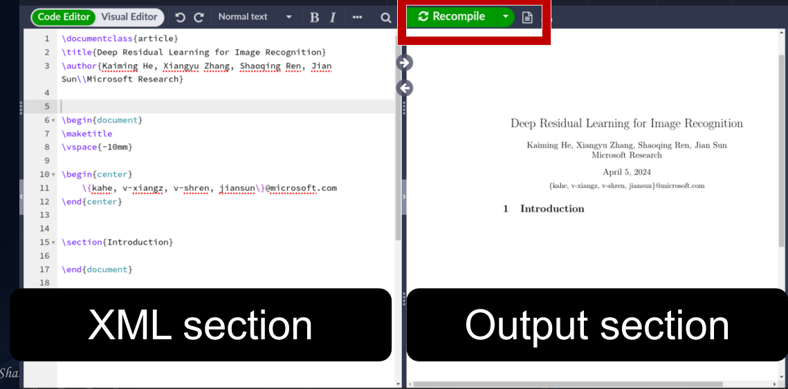

# **LaTex**

## What is LaTex
* Pronounced as **“Lay tech”** or __“Leh tech”__ not __“Lay teks/ Lay tex”__
* Document preparation system for high quality __typesetting__

* Most often used to produce __technical__ or __scientific documents.__

* Normally used for almost any form of publishing.


## Installing LaTex
### MiKTex
* Typesetting system for the windows
* Download from www.miketex.org for free
* Generally recomended to install MikTex first and then WinEdt. 


### WinEdt

* WinEdt is a text editor
* WinEdt creates the source file (.text and other)
* Download from www.winedt.com for free 30 days
* WinEdt costs $30

### Other text editors
* Winshell for free (http://www.winshell.de/)
* Scientific Workplace
    * Combination of LaTex and Mathematical program
    * Does a good job of calculating anf graph ploting, vary user friendly but expensive. 
* TextShop for Mac
    * Downlod for free from http://www.uoregon.edu/~koch/texshop

## LaTex in Overleaf
### Why in Overleaf
* No need any installation
* Its free to use
* All the functionalities can be * performed. 
* Onlined based
* Multiple person can share the same file


## LaTex vs Documents
  

## Overleaf UI
  

## Lets Start Working in Overleaf (General Praspective)

### Document class
```
\documentclass(something)
```
something can be: __article__, __beamer__, __book__, __letter__, __report__


### Title


## Lets Start Working in Overleaf (IEEE Formate)
### Document class
```
\documentclass[conference]{IEEEtran}
```

### Basic Structure with documents begin & end
```
\documentclass[conference]{IEEEtran}

\begin{document}


\end{document}

```

### Title
Title is not in the documents part, this title section. 
```
\documentclass[conference]{IEEEtran}

\title{An Effective DNN based ResNet Approach for Satellite Image Classification}

\begin{document}


\end{document}
```
__if you compile, there will be an error because the title is not defined in the document section. so proper xml will be 

```
\documentclass[conference]{IEEEtran}

\title{An Effective DNN based ResNet Approach for Satellite Image Classification}

\begin{document}

\maketitle

\end{document}
```


